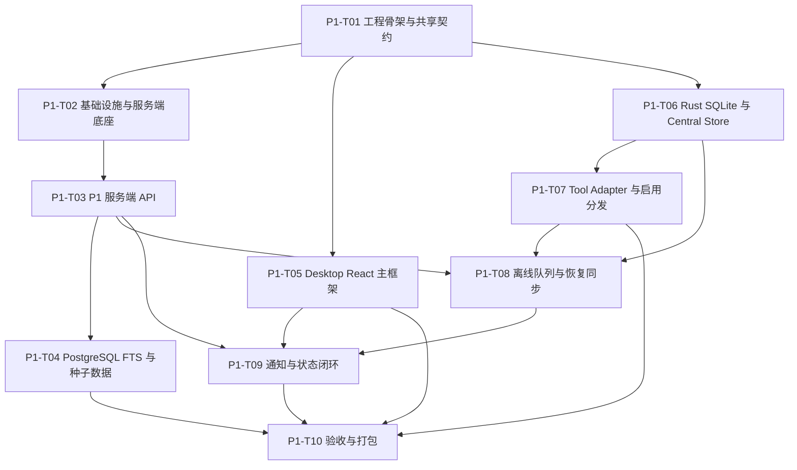

# 02. P1 任务详细设计

## 1. 任务目标

P1 任务以 Windows-first Desktop 使用闭环为唯一正式交付面，目标是在企业内网中完成：

- 用户登录、连接状态和身份展示。
- 游客优先进入本地工作台，并在需要后端能力时弹出登录框。
- 市场浏览、搜索、筛选、详情和受限详情。
- Skill 安装、更新、卸载到本机 Central Store。
- Skill 启用/停用到工具或项目目录，按本详细设计采用 symlink 优先、失败 copy。
- 本机工具/项目路径配置、检测、异常提示。
- 应用内通知、离线本地使用和恢复同步。
- 显式菜单权限、最小可用审核页和完整管理页。

不进入 P1 任务：

- 发布 Skill 表单、审核处理动作（锁单、同意、拒绝、退回）。
- Web 管理台、企业统一身份源、企业 IM、系统托盘。
- 独立搜索引擎、微服务拆分、MCP/插件/RAG、风险脚本扫描。

## 2. 任务分组总览

| 任务包 | 名称 | 主责模块 | 前置依赖 | 交付物 |
| --- | --- | --- | --- | --- |
| P1-T01 | 工程骨架与共享契约 | Repo / Shared | 无 | monorepo 目录、共享枚举/DTO、基础脚本。 |
| P1-T02 | 基础设施与服务端底座 | API / Infra | P1-T01 | PostgreSQL、Redis、MinIO、NestJS 配置、健康检查。 |
| P1-T03 | P1 服务端 API | API | P1-T02 | Session Auth、Bootstrap、Menu Permissions、Market、Detail、Download Ticket、Star、Notifications、Local Events。 |
| P1-T04 | PostgreSQL FTS 与种子数据 | API / DB | P1-T03 | P1 市场种子数据、FTS 索引、筛选排序。 |
| P1-T05 | Desktop React 主框架 | Desktop React | P1-T01 | 游客优先 Shell、登录弹窗、首页、市场、我的 Skill、工具、项目、通知、设置。 |
| P1-T05A | 审核与管理入口 | Desktop React + API | P1-T03, P1-T05 | 最小可用审核页、完整管理页、权限驱动导航。 |
| P1-T06 | Rust SQLite 与 Central Store | Tauri Rust | P1-T01 | 本地 DB 迁移、Central Store、下载校验、安装/更新/卸载命令。 |
| P1-T07 | Tool Adapter 与启用分发 | Tauri Rust | P1-T06 | 内置 Adapter、路径探测、格式转换、symlink/copy 分发。 |
| P1-T08 | 离线队列与恢复同步 | Desktop + API + Rust | P1-T03, P1-T06, P1-T07 | SQLite 队列、`/desktop/local-events` 同步、冲突提示。 |
| P1-T09 | 通知与状态闭环 | Desktop + API + Rust | P1-T03, P1-T05, P1-T08 | 连接、安装、更新、权限收缩、路径异常通知。 |
| P1-T10 | P1 验收与打包 | All | P1-T01 到 P1-T09 | E2E 用例、Adapter fixture、Windows exe 构建、部署说明。 |

## 3. P1-T01 工程骨架与共享契约

### 范围

- 建立 `apps/desktop`、`apps/api`、`packages/shared-contracts`、`packages/tool-adapter-fixtures`、`infra`。
- 固化 P1 枚举、错误码、分页响应、基础 DTO。
- 统一 `skillID`、`userID` 等历史字段写法，JSON 字段保持 camelCase。

### 关键契约

共享枚举至少包含：

- `skillStatus`: `published | delisted | archived`
- `visibilityLevel`: `private | summary_visible | detail_visible | public_installable`
- `detailAccess`: `none | summary | full`
- `riskLevel`: `low | medium | high | unknown`
- `installState`: `not_installed | installed | enabled | update_available | blocked`
- `targetType`: `tool | project`
- `adapterStatus`: `detected | manual | missing | invalid | disabled`
- `installMode`: `symlink | copy`
- `requestedMode`: `symlink | copy`
- `resolvedMode`: `symlink | copy`
- `notificationType`: 覆盖更新、权限收缩、连接恢复/失败、路径异常、安装/更新/卸载/启用/停用结果。

### 验收

- Desktop 与 API 可以引用同一份 TypeScript 契约。
- OpenAPI 或 DTO 命名与 `docs/RequirementDocument/21_p1_data_contract.md` 不漂移。
- `installMode` 不再写死为 copy-only，能表达 symlink 请求和 copy 降级结果。

## 4. P1-T02 基础设施与服务端底座

### 范围

- NestJS 配置、环境变量、日志、全局异常响应。
- PostgreSQL 迁移基线。
- Redis + BullMQ 队列注册。
- MinIO bucket 初始化和健康检查。
- `/health` 返回 API、PostgreSQL、Redis、MinIO 状态。

### 环境变量建议

| 变量 | 用途 |
| --- | --- |
| `API_PORT` | NestJS 监听端口。 |
| `DATABASE_URL` | PostgreSQL 连接串。 |
| `REDIS_URL` | BullMQ Redis 连接串。 |
| `MINIO_ENDPOINT` | MinIO 内网地址。 |
| `MINIO_ACCESS_KEY` / `MINIO_SECRET_KEY` | MinIO 凭据。 |
| `MINIO_SKILL_PACKAGE_BUCKET` | Skill 包 bucket。 |
| `MINIO_SKILL_ASSET_BUCKET` | Skill 资源 bucket。 |
| `SESSION_TTL_SECONDS` | 自建账号 session 默认有效期。 |

### 验收

- API 在 Linux 服务器或本地容器环境可启动。
- `/health` 能区分数据库、Redis、MinIO 任一组件不可用。
- 数据库迁移可重复执行，不依赖手工建表。

## 5. P1-T03 P1 服务端 API

### 接口范围

| 接口 | 责任 | 关键实现 |
| --- | --- | --- |
| `POST /auth/login` | 自建账号登录 | 返回 session token、用户摘要和 `menuPermissions`。 |
| `POST /auth/logout` | 退出登录 | 服务端撤销当前 session。 |
| `GET /desktop/bootstrap` | 启动上下文 | 返回用户、连接、功能开关、首页计数、导航和 `menuPermissions`。 |
| `GET /skills` | 市场列表和搜索 | 应用权限过滤、FTS、筛选、排序、分页。 |
| `GET /skills/{skillID}` | 详情/受限详情 | 按 `detailAccess` 返回摘要或完整详情。 |
| `POST /skills/{skillID}/download-ticket` | 安装/更新前授权 | 校验可安装/可更新，返回短期 URL、SHA-256、大小、文件数。 |
| `POST /skills/{skillID}/star` | Star | 幂等收藏并返回最新数量。 |
| `DELETE /skills/{skillID}/star` | 取消 Star | 幂等取消并返回最新数量。 |
| `GET /notifications` | 通知列表 | 支持未读过滤和分页。 |
| `POST /notifications/mark-read` | 标记已读 | 支持单条、多条、全部。 |
| `POST /desktop/local-events` | 本地事件同步 | 接收启用/停用/结果事件，不改变服务端治理状态。 |
| `GET /admin/reviews` / `GET /admin/reviews/{id}` | 审核只读 | 返回待审核 / 审核中 / 已审核列表和详情。 |
| `GET/POST/PATCH/DELETE /admin/departments` | 部门管理 | 返回部门树并支持后代部门维护。 |
| `GET/POST/PATCH/DELETE /admin/users` | 用户管理 | 支持创建、角色调整、冻结、删除，并撤销会话。 |
| `GET /admin/skills` + `POST/DELETE` 状态接口 | Skill 管理 | 支持上下架与归档。 |

### 权限口径

- Desktop 不自行推导跨部门权限，服务端直接返回 `detailAccess`、`canInstall`、`canUpdate`、`cannotInstallReason`。
- Desktop 不自行推导菜单权限，统一消费服务端 `menuPermissions`。
- 下架、归档、权限收缩时，download-ticket 必须拒绝新增安装和更新。
- 已安装用户能否继续启用当前本地版本由本地 SQLite 状态和最近服务端同步结果共同展示，但服务端不下发删除本地副本指令。

### 验收

- 未登录访问 P1 API 返回稳定 `unauthenticated`。
- 无详情权限不会返回 README、审核摘要、包对象引用或下载凭证。
- download-ticket 的 `packageHash` 必须是 `sha256:<hex>` 格式。
- `/desktop/local-events` 对重复 `deviceID + eventID` 幂等。

## 6. P1-T04 PostgreSQL FTS 与种子数据

### 范围

- 为 P1 市场准备可验收的种子数据：已安装、有更新、权限收缩、受限详情、下架/归档不可安装、风险等级不同、兼容工具不同。
- 使用 PostgreSQL FTS 支持名称、描述、标签、作者、部门、`skillID` 搜索。
- 支持 P1 必做筛选：部门、工具兼容性、是否已安装、是否已启用、是否仅显示我有权限查看。

### 搜索实现建议

- 维护 `skill_search_documents` 或在 `skills` 查询视图中生成 `search_vector`。
- 使用 GIN 索引。
- `sort=relevance` 使用 `ts_rank_cd`。
- `sort=composite` 使用 `rank + starCount + downloadCount + updatedAt` 的轻量权重。

### 验收

- 搜 `skillID`、作者、部门、标签都能命中。
- 无权限 Skill 不通过搜索泄漏完整详情。
- 筛选和排序组合不会绕过服务端权限过滤。

## 7. P1-T05 Desktop React 主框架

### 页面范围

| 页面 | 必做状态 |
| --- | --- |
| 登录 | 模态框触发、服务地址展示、用户名/密码、登录失败、服务不可用。 |
| 首页 | 连接状态、已安装、已启用、可更新、最近更新、热门推荐、通知摘要。 |
| 市场 | 搜索、筛选、排序、列表、简单榜单、离线禁用态、空态。 |
| Skill 详情 | 完整详情、受限详情、安装/更新/启用/卸载/Star 操作区。 |
| 我的 Skill | 已安装列表、更新、权限收缩、异常、本地 Hash 变化提示。 |
| 工具 | Adapter 列表、检测状态、路径、启用数量、刷新检测、手动路径。 |
| 项目 | 添加项目、项目路径、skills 路径、启用数量、项目级优先提示。 |
| 通知 | 全部/未读、标记已读、跳转关联对象。 |
| 审核 | 在线管理员可见，待审核/审核中/已审核列表与详情。 |
| 管理 | 在线管理员可见，部门树、用户管理、Skill 管理。 |
| 设置 | 语言、Central Store 路径展示、同步偏好。 |

### React 状态来源

- 服务端数据：bootstrap、市场、详情、通知。
- Rust 本地数据：本地安装、工具配置、项目配置、启用目标、离线队列状态。
- UI 临时状态：弹窗、进度条、筛选项、表单输入。

### 验收

- 游客默认进入本地工作台；点击市场、通知或远端操作时弹出登录框。
- 审核、管理页签只在在线且具备 `menuPermissions` 时显示。
- 离线时市场搜索、安装、更新按钮禁用，但我的已安装可打开并能启用/停用。
- 所有本地写入动作都显示阶段、结果和失败原因。
- 覆盖、卸载、删除目标副本类操作必须二次确认。

## 8. P1-T06 Rust SQLite 与 Central Store

### SQLite 迁移

第一阶段至少包含：

- `local_skill_installs`
- `enabled_targets`
- `tool_configs`
- `project_configs`
- `offline_event_queue`
- `local_notifications`
- `sync_state`
- `store_metadata`

### Central Store 写入流程

1. Rust 根据 download-ticket 下载到 `downloads/{ticketID}.tmp`。
2. 校验包大小不超过 5MB。
3. 解包或扫描压缩包元数据，校验文件数不超过 100。
4. 计算 SHA-256 并与服务端 `packageHash` 比对。
5. 校验根目录存在 `SKILL.md`。
6. 写入 `skills/{skillID}/{version}`，更新 `local_skill_installs`。
7. 失败时删除临时文件，不修改现有可用版本。

### 命令范围

- `get_local_bootstrap`
- `install_skill_package`
- `update_skill_package`
- `uninstall_skill`
- `get_local_skill`
- `list_local_installs`

### 验收

- 安装失败不会留下半写入 Central Store 状态。
- 更新失败保留旧版本。
- 卸载前能返回所有启用目标，确认后再删除。
- 所有状态可在应用重启后从 SQLite 恢复。

## 9. P1-T07 Tool Adapter 与启用分发

### 内置 Adapter

| toolID | 检测 | 转换策略 | 默认目标 |
| --- | --- | --- | --- |
| `codex` | 注册表、默认路径、手动路径 | `codex_skill` | `%USERPROFILE%\\.codex\\skills` |
| `claude` | 注册表、默认路径、手动路径 | `claude_skill` | `%USERPROFILE%\\.claude\\skills` |
| `cursor` | 注册表、默认路径、手动路径 | `cursor_rule` | `%USERPROFILE%\\.cursor\\rules` |
| `windsurf` | 注册表、默认路径、手动路径 | `windsurf_rule` | `%USERPROFILE%\\.windsurf\\skills` |
| `opencode` | 注册表、默认路径、手动路径 | `opencode_skill` | `%USERPROFILE%\\.opencode\\skills` |
| `custom_directory` | 手动路径 | `generic_directory` | 用户选择路径 |

### 启用流程

1. 读取 `local_skill_installs`，确认 Skill 已安装。
2. 读取目标 `tool_configs` 或 `project_configs`。
3. Adapter 生成目标工具产物到 `derived/{skillID}/{version}/{toolID}`。
4. 校验目标路径可写。
5. 尝试 symlink。
6. symlink 失败则 copy。
7. 写入 `enabled_targets`，记录 `requested_mode`、`resolved_mode`、`fallback_reason`、`artifact_hash`。
8. 写入 `offline_event_queue`，等待恢复联网后同步。

### 验收

- Codex、Claude、Cursor、Windsurf、opencode 转换结果都有 golden fixture。
- symlink 成功时目标路径不复制实体目录。
- symlink 失败时自动 copy，UI 能展示“已降级为 copy”。
- 停用只删除本系统托管目标，不误删手工目录。
- 项目级路径与工具级路径冲突时，UI 和状态展示项目级优先。

## 10. P1-T08 离线队列与恢复同步

### 本地队列事件

| eventType | 触发 |
| --- | --- |
| `enable_result` | 启用到工具或项目后。 |
| `disable_result` | 停用工具或项目后。 |
| `uninstall_result` | 卸载完成或部分失败后。 |
| `target_path_invalid` | 检测到路径不可用。 |
| `local_copy_blocked` | copy 降级或写入失败。 |

### 同步规则

- 离线期间只允许本地启用/停用已安装 Skill。
- 恢复网络后批量调用 `/desktop/local-events`。
- 服务端返回 `remoteNotices` 后写入本地通知缓存。
- 若服务端状态变化为权限收缩、下架、有新版本，只提示用户，不自动删除或覆盖本地副本。

### 验收

- 断网启用/停用后重启应用，队列仍存在。
- 重复同步不产生重复服务端事件。
- 服务端拒绝部分事件时，本地能记录失败原因并允许重试。

## 11. P1-T09 通知与状态闭环

### 通知来源

- 服务端通知：版本更新、权限收缩、系统消息。
- 本地通知：安装/更新/卸载/启用/停用结果、路径异常、连接失败/恢复。
- 同步通知：恢复同步后服务端返回的 `remoteNotices`。

### 状态展示规则

- `connected`：市场、安装、更新可用。
- `connecting`：保留当前页面，写操作按钮进入等待或禁用。
- `offline`：市场搜索、安装、更新不可用；本地已安装可启用/停用。
- `failed`：展示错误详情和重试入口。

### 验收

- 未读数量在顶栏、通知页、bootstrap 后一致。
- 标记已读离线时先写本地，联网后可补同步。
- 路径异常通知能跳转工具或项目页。

## 12. P1-T10 验收与打包

### 必测路径

1. 首次登录后 bootstrap 正常，导航只有 P1 页面。
2. 市场搜索、筛选、排序可组合使用。
3. 受限详情不泄漏 README、审核摘要和包信息。
4. 安装成功写入 Central Store 和 SQLite。
5. Hash 不匹配安装失败，旧状态不变。
6. 更新前发现本地 Hash 变化并提示覆盖。
7. 启用到 Codex symlink 成功。
8. 模拟 symlink 失败后自动 copy，记录降级原因。
9. 停用目标不删除 Central Store。
10. 卸载列出所有启用位置，确认后删除 Central Store 和托管目标。
11. 离线可启用/停用已安装 Skill，不可搜索、安装、更新。
12. 恢复联网后同步本地事件并显示远端状态变化提示。

### 打包交付

- Windows exe 安装包。
- Linux 服务端部署说明。
- PostgreSQL、Redis、MinIO 环境变量模板。
- 种子数据导入脚本。
- Adapter fixture 验收报告。

## 13. 任务依赖顺序

## 14. 已同步的需求差异

需求文档 P1 旧口径写明“仅 copy，不使用 symlink”。本详细设计按最新技术要求改为：

- `requestedMode` 默认 `symlink`。
- symlink 成功则 `resolvedMode=symlink`。
- symlink 失败自动降级 copy，`resolvedMode=copy`，并记录 `fallbackReason`。
- 本地和服务端事件都应能记录实际模式，但服务端不以此改变权限或治理状态。

当前已同步更新：

- `docs/RequirementDocument/20_p1_desktop_prd.md` 的启用方式与验收项。
- `docs/RequirementDocument/21_p1_data_contract.md` 的 `installMode`、`requestedMode`、`resolvedMode` 和 `/desktop/local-events` 字段。
- `docs/RequirementDocument/22_p1_tool_adapter_contract.md` 的安装模式、fallback 记录和冲突规则。
