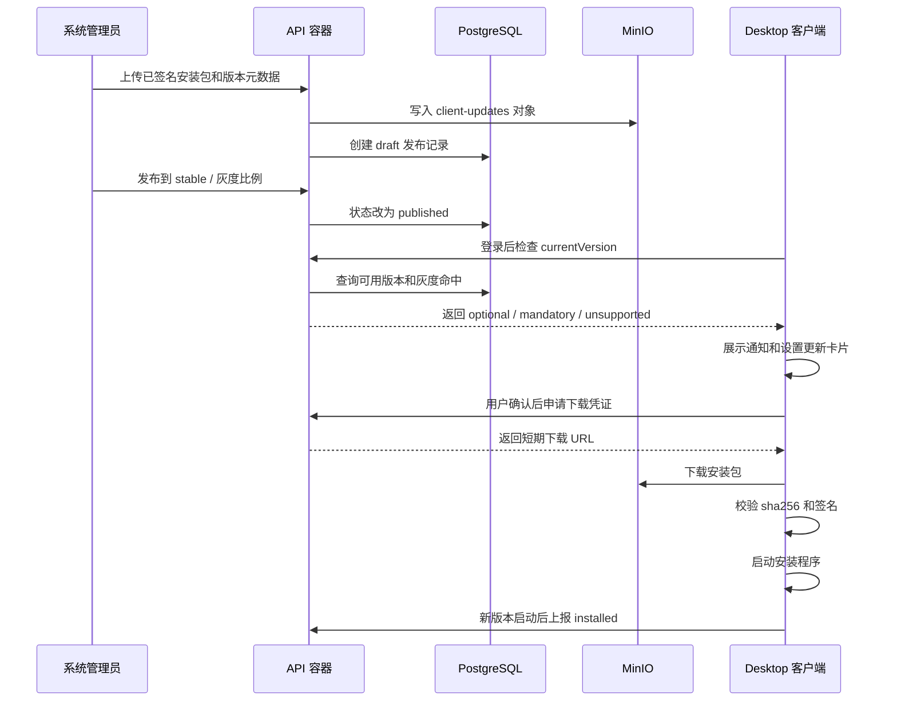

# 06. 客户端在线升级详细设计

## 1. 结论

客户端在线升级采用“服务端发布元数据 + MinIO 存储安装包 + Desktop 登录后检查 + 用户确认安装”的方案。

推荐第一阶段实现：

- 服务端新增 `ClientUpdatesModule`，负责版本检测、下载凭证、管理员发布、灰度、暂停、撤回和事件上报。
- MinIO 新增 `client-updates` bucket，存储 Windows x64 客户端完整安装包。
- PostgreSQL 保存客户端版本、渠道、Hash、签名、灰度、状态和更新事件。
- Desktop 登录成功并完成 `/desktop/bootstrap` 后调用更新检查接口。
- 更新提示同时出现在顶栏通知和设置模态；设置模态保留当前版本、最新版本、检查失败和手动检查入口。
- 管理员在 Linux Docker 服务器上只上传和发布 CI 已构建、已签名的安装包，不在生产服务器构建客户端。

首期不引入差分更新和静默安装。客户端只在用户确认后下载完整安装包，校验通过后启动系统安装程序。

## 2. 总体链路



## 3. 服务端模块设计

### 3.1 NestJS 模块

新增模块建议：

```text
apps/api/src/client-updates/
├── client-updates.module.ts
├── client-updates.controller.ts
├── client-updates.service.ts
├── client-updates.repository.ts
├── client-updates-admin.controller.ts
├── client-update-storage.service.ts
├── client-update-rollout.service.ts
├── client-update-publish.service.ts
└── client-updates.types.ts
```

职责拆分：

| 文件 | 责任 |
| --- | --- |
| `client-updates.controller.ts` | 面向 Desktop 的检查、下载凭证和事件上报接口。 |
| `client-updates-admin.controller.ts` | 面向管理员的创建、上传、发布、灰度、暂停、撤回接口。 |
| `client-updates.service.ts` | 聚合检测逻辑，判断是否有新版本、是否强制更新、是否命中灰度。 |
| `client-update-storage.service.ts` | 写入 MinIO、生成短期下载 URL、校验对象存在性。 |
| `client-update-rollout.service.ts` | 根据设备 ID、用户 ID、部门或渠道判断是否命中灰度。 |
| `client-update-publish.service.ts` | 管理发布状态流转和版本唯一性校验。 |
| `client-updates.repository.ts` | PostgreSQL 读写。 |

模块依赖：

- `AuthModule`：校验用户身份和管理员权限。
- `NotificationsModule`：生成软件更新通知。
- `StorageModule` 或现有 MinIO 封装：复用对象存储能力。
- `HealthModule`：扩展检查 `client-updates` bucket 是否可用。

### 3.2 API 设计

Desktop 检查更新：

```http
POST /client-updates/check
Authorization: Bearer <token>
Content-Type: application/json
```

请求：

```json
{
  "currentVersion": "1.5.0",
  "buildNumber": "20260419.1",
  "platform": "windows",
  "arch": "x64",
  "osVersion": "Windows 11 23H2",
  "channel": "stable",
  "deviceID": "device-001",
  "dismissedVersion": "1.5.1"
}
```

响应：

```json
{
  "status": "update_available",
  "updateType": "optional",
  "currentVersion": "1.5.0",
  "latestVersion": "1.6.0",
  "releaseID": "rel_01",
  "channel": "stable",
  "packageName": "EnterpriseAgentHub_1.6.0_x64-setup.exe",
  "sizeBytes": 124000000,
  "sha256": "hex-encoded-sha256",
  "publishedAt": "2026-04-19T10:00:00.000Z",
  "releaseNotes": "修复发布中心稳定性问题，并优化设置页更新提示。",
  "mandatory": false,
  "minSupportedVersion": "1.4.0",
  "downloadTicketRequired": true
}
```

`status` 取值：

| 状态 | 说明 |
| --- | --- |
| `up_to_date` | 当前已是最新可用版本。 |
| `update_available` | 可选更新。 |
| `mandatory_update` | 强制更新。 |
| `unsupported_version` | 当前版本低于服务端最低支持版本。 |
| `check_failed` | 服务端内部可恢复错误，一般不建议直接返回给客户端，优先使用标准错误响应。 |

申请下载凭证：

```http
POST /client-updates/releases/{releaseID}/download-ticket
Authorization: Bearer <token>
```

响应：

```json
{
  "downloadURL": "https://minio.example.local/client-updates/...",
  "expiresAt": "2026-04-19T10:15:00.000Z",
  "sha256": "hex-encoded-sha256",
  "signatureStatus": "signed"
}
```

上报事件：

```http
POST /client-updates/events
Authorization: Bearer <token>
Content-Type: application/json
```

事件类型：

- `prompted`
- `dismissed`
- `download_started`
- `download_failed`
- `downloaded`
- `hash_failed`
- `signature_failed`
- `installer_started`
- `install_cancelled`
- `installed`

管理员接口：

| 方法 | 路径 | 说明 |
| --- | --- | --- |
| `POST` | `/admin/client-updates/releases` | 创建 draft 发布记录。 |
| `POST` | `/admin/client-updates/releases/{releaseID}/artifact` | 上传安装包或登记已上传对象。 |
| `POST` | `/admin/client-updates/releases/{releaseID}/publish` | 发布到渠道。 |
| `PATCH` | `/admin/client-updates/releases/{releaseID}/rollout` | 调整灰度比例。 |
| `POST` | `/admin/client-updates/releases/{releaseID}/pause` | 暂停提示和下载。 |
| `POST` | `/admin/client-updates/releases/{releaseID}/yank` | 撤回问题版本。 |
| `GET` | `/admin/client-updates/releases` | 查询发布记录和事件摘要。 |

管理员接口必须要求系统管理员权限，并写入审计日志。

## 4. 数据模型设计

### 4.1 PostgreSQL 表

`client_releases`

| 字段 | 类型 | 说明 |
| --- | --- | --- |
| `id` | uuid | 发布 ID。 |
| `version` | text | SemVer 版本号。 |
| `build_number` | text | 构建号或提交号。 |
| `platform` | text | `windows`。 |
| `arch` | text | `x64`。 |
| `channel` | text | `stable` / `internal` / `beta`。 |
| `status` | text | `draft` / `published` / `paused` / `yanked`。 |
| `mandatory` | boolean | 是否强制更新。 |
| `min_supported_version` | text | 最低支持版本。 |
| `rollout_percent` | integer | 0 到 100。 |
| `release_notes` | text | 更新说明。 |
| `created_by` | uuid | 创建管理员。 |
| `published_by` | uuid | 发布管理员。 |
| `published_at` | timestamptz | 发布时间。 |
| `created_at` | timestamptz | 创建时间。 |
| `updated_at` | timestamptz | 更新时间。 |

唯一约束：

- `platform + arch + channel + version` 唯一。
- 同一 `platform + arch + channel` 可以有多个 `published` 版本，但检测时只选择版本号最高且命中灰度的版本。

`client_release_artifacts`

| 字段 | 类型 | 说明 |
| --- | --- | --- |
| `id` | uuid | 安装包 ID。 |
| `release_id` | uuid | 关联 `client_releases.id`。 |
| `bucket` | text | 默认 `client-updates`。 |
| `object_key` | text | MinIO 对象 key。 |
| `package_name` | text | 文件名。 |
| `size_bytes` | bigint | 包大小。 |
| `sha256` | text | SHA-256。 |
| `signature_status` | text | `signed` / `unsigned` / `unknown`。 |
| `created_at` | timestamptz | 创建时间。 |

`client_update_events`

| 字段 | 类型 | 说明 |
| --- | --- | --- |
| `id` | uuid | 事件 ID。 |
| `release_id` | uuid | 可为空，检查失败或无更新时可不关联。 |
| `user_id` | uuid | 当前用户。 |
| `device_id` | text | 当前设备。 |
| `from_version` | text | 上报前客户端版本。 |
| `to_version` | text | 目标版本。 |
| `event_type` | text | 下载、校验、安装等事件。 |
| `error_code` | text | 失败时的结构化错误。 |
| `created_at` | timestamptz | 事件时间。 |

### 4.2 MinIO 对象结构

推荐对象 key：

```text
client-updates/
└── windows/
    └── x64/
        └── stable/
            └── 1.6.0/
                ├── EnterpriseAgentHub_1.6.0_x64-setup.exe
                ├── EnterpriseAgentHub_1.6.0_x64-setup.exe.sha256
                └── release-notes.md
```

对象写入规则：

- API 上传前校验文件大小上限，建议默认 500 MB。
- API 写入 MinIO 后重新读取对象元数据并校验 size。
- `sha256` 以服务端计算结果为准；管理员传入值只用于交叉校验。
- 不允许覆盖已发布版本的对象。需要修复时发布新版本或撤回旧版本后重新创建 draft。

## 5. Desktop 设计

### 5.1 模块拆分

建议新增：

```text
apps/desktop/src/services/p1Client/clientUpdates.ts
apps/desktop/src/state/workspace/useWorkspaceClientUpdates.ts
apps/desktop/src/state/ui/useClientUpdatePrompt.ts
apps/desktop/src/ui/ClientUpdateDialog.tsx
```

Tauri/Rust 建议新增命令：

| Command | 说明 |
| --- | --- |
| `get_app_version` | 返回当前客户端版本、构建号、平台和架构。 |
| `download_client_update` | 下载更新包到受控临时目录，支持进度事件。 |
| `verify_client_update` | 校验 SHA-256 和 Windows 代码签名。 |
| `launch_client_installer` | 用户确认后启动安装程序，并准备退出当前应用。 |

### 5.2 本地状态

SQLite 建议增加 `client_update_cache`：

| 字段 | 说明 |
| --- | --- |
| `channel` | 当前检查渠道。 |
| `current_version` | 检查时本地版本。 |
| `latest_version` | 最近一次发现的版本。 |
| `release_id` | 最近一次发现的发布 ID。 |
| `update_type` | `optional` / `mandatory` / `unsupported`。 |
| `dismissed_version` | 用户选择稍后提醒的版本。 |
| `last_checked_at` | 最近检查时间。 |
| `last_error_code` | 最近检查失败原因。 |
| `downloaded_path` | 已下载且校验通过的临时包路径。 |

该缓存只用于减少重复打扰和支持设置页展示，不作为安装包可信依据。安装前仍必须重新校验 Hash，并在必要时重新向服务端检查版本状态。

### 5.3 检测时机

推荐在当前 `useWorkspaceSessionFlow` 或等价登录会话流程中串联：

1. 登录成功或会话恢复。
2. 拉取 `/desktop/bootstrap`。
3. 调用 Tauri 获取当前应用版本。
4. 调用 `/client-updates/check`。
5. 写入更新状态。
6. 如果存在新版本，生成本地 UI 状态并触发服务端通知或拉取到通知面板。

设置模态打开时：

- 若 `last_checked_at` 在 30 分钟内，优先展示缓存。
- 用户点击“重新检查”时绕过缓存。
- 检查失败时保留旧的可用更新提示，但标注最新检查失败。

### 5.4 强制更新限制

当服务端返回 `mandatory_update` 或 `unsupported_version`：

- 允许浏览本地已安装 Skill、设置和通知。
- 阻止发布、审核、管理、安装 Skill、更新 Skill、远端同步等写入型操作。
- 所有受限按钮使用同一提示：`当前客户端版本过低，请先升级后继续。`
- 不阻止用户退出登录或调整本地基础设置。

## 6. 通知与设置集成

服务端可以在检查接口中返回更新状态，也可以异步生成通知。Desktop 需要保证两处显示一致：

- 顶栏铃铛：展示软件更新通知，点击打开更新弹窗。
- 设置模态：展示更新卡片，即使通知已读也不消失。

建议 UI 状态来源优先级：

1. 当前会话刚返回的 `/client-updates/check`。
2. 本地 `client_update_cache`。
3. 服务端通知列表中的软件更新通知。

当管理员撤回版本后，下一次检查必须清理本地该版本提示，并将对应通知标记为失效或展示“该版本已撤回”。

## 7. Linux Docker 更新包推送操作

### 7.1 前置准备

生产服务器不构建客户端。管理员应从 CI 或可信构建机拿到以下交付物：

```text
EnterpriseAgentHub_1.6.0_x64-setup.exe
EnterpriseAgentHub_1.6.0_x64-setup.exe.sha256
release-notes.md
```

本地校验：

```bash
sha256sum -c EnterpriseAgentHub_1.6.0_x64-setup.exe.sha256
```

上传到服务器：

```bash
ssh admin@server "mkdir -p /opt/EnterpriseAgentHub/release/client-updates/1.6.0"

scp EnterpriseAgentHub_1.6.0_x64-setup.exe \
  EnterpriseAgentHub_1.6.0_x64-setup.exe.sha256 \
  release-notes.md \
  admin@server:/opt/EnterpriseAgentHub/release/client-updates/1.6.0/
```

### 7.2 Docker 发布命令

建议在 API 镜像内提供一个幂等发布脚本，命名为：

```bash
npm run client-update:publish
```

管理员进入服务器项目目录：

```bash
cd /opt/EnterpriseAgentHub
export VERSION=1.6.0
export CHANNEL=stable
export PACKAGE=EnterpriseAgentHub_${VERSION}_x64-setup.exe
export RELEASE_DIR=/opt/EnterpriseAgentHub/release/client-updates/${VERSION}
export SHA256=$(awk '{print $1}' "${RELEASE_DIR}/${PACKAGE}.sha256")
```

将文件复制进 API 容器临时目录：

```bash
docker compose -f infra/docker-compose.prod.yml exec api \
  mkdir -p /tmp/client-updates

docker compose -f infra/docker-compose.prod.yml cp \
  "${RELEASE_DIR}/${PACKAGE}" \
  api:/tmp/client-updates/${PACKAGE}

docker compose -f infra/docker-compose.prod.yml cp \
  "${RELEASE_DIR}/release-notes.md" \
  api:/tmp/client-updates/release-notes.md
```

发布为草稿并上传对象：

```bash
docker compose -f infra/docker-compose.prod.yml exec api \
  npm run client-update:publish -- \
  --version "${VERSION}" \
  --build-number "20260419.1" \
  --platform windows \
  --arch x64 \
  --channel "${CHANNEL}" \
  --file "/tmp/client-updates/${PACKAGE}" \
  --sha256 "${SHA256}" \
  --release-notes-file "/tmp/client-updates/release-notes.md" \
  --mandatory false \
  --min-supported-version "1.4.0" \
  --rollout-percent 10 \
  --status published
```

该脚本内部必须执行：

1. 校验管理员身份或要求传入一次性管理员 token。
2. 校验 SemVer 递增和版本唯一性。
3. 计算文件 SHA-256，与传入值比对。
4. 检查 Windows 签名状态，至少记录 `signed` / `unsigned`。
5. 上传到 MinIO `client-updates` bucket。
6. 创建或更新 draft 记录。
7. 在事务中切换为 `published`。
8. 写入审计日志。

如果当前部署仍使用 legacy Compose，命令改为：

```bash
docker-compose -f infra/docker-compose.legacy.yml exec api ...
```

### 7.3 灰度扩大、暂停与撤回

灰度从 10% 扩大到 100%：

```bash
docker compose -f infra/docker-compose.prod.yml exec api \
  npm run client-update:rollout -- \
  --version "1.6.0" \
  --platform windows \
  --arch x64 \
  --channel stable \
  --rollout-percent 100
```

暂停问题版本：

```bash
docker compose -f infra/docker-compose.prod.yml exec api \
  npm run client-update:pause -- \
  --version "1.6.0" \
  --platform windows \
  --arch x64 \
  --channel stable \
  --reason "安装后启动异常，暂停分发"
```

撤回问题版本：

```bash
docker compose -f infra/docker-compose.prod.yml exec api \
  npm run client-update:yank -- \
  --version "1.6.0" \
  --platform windows \
  --arch x64 \
  --channel stable \
  --reason "发现高风险缺陷，停止提示和下载"
```

暂停后客户端不再收到该版本提示，但已下载的本地包仍需要在安装前重新检查版本状态。撤回后下载凭证不得继续签发。

### 7.4 发布后验证

容器健康检查：

```bash
docker compose -f infra/docker-compose.prod.yml ps
curl -fsS http://127.0.0.1:3000/health
```

模拟旧客户端检查：

```bash
curl -fsS -X POST "http://127.0.0.1:3000/client-updates/check" \
  -H "Authorization: Bearer ${ADMIN_OR_TEST_USER_TOKEN}" \
  -H "Content-Type: application/json" \
  -d '{
    "currentVersion": "1.5.0",
    "buildNumber": "ops-smoke",
    "platform": "windows",
    "arch": "x64",
    "osVersion": "Windows 11",
    "channel": "stable",
    "deviceID": "ops-smoke-device"
  }'
```

预期结果：

- `status` 为 `update_available` 或 `mandatory_update`。
- `latestVersion` 等于刚发布版本。
- `sha256` 与交付物一致。
- `releaseID` 非空。

申请下载凭证并校验对象可下载：

```bash
curl -fsS -X POST "http://127.0.0.1:3000/client-updates/releases/${RELEASE_ID}/download-ticket" \
  -H "Authorization: Bearer ${ADMIN_OR_TEST_USER_TOKEN}"
```

管理员还应使用一台真实旧版本 Windows 客户端完成一次端到端验收：登录、看到通知、设置页提示、下载、校验、启动安装程序、新版本启动后提示消失。

## 8. 灰度算法

推荐使用稳定哈希命中：

```text
hash(platform + arch + channel + version + deviceID) % 100 < rolloutPercent
```

规则：

- 同一设备对同一版本的命中结果稳定。
- `rolloutPercent=0` 表示只保留发布记录，不对普通客户端可见。
- `mandatory=true` 不等于 100% 灰度；强制更新只对已命中灰度或全量发布的客户端生效。
- 管理员和内测渠道可通过 `channel=internal` 提前验证。

## 9. 安全约束

- 更新检查和下载凭证接口必须要求登录态。
- 管理员发布接口必须要求系统管理员权限。
- 下载 URL 必须短期有效，建议 10 到 15 分钟。
- 客户端下载完成后必须校验 SHA-256，不通过则删除临时包。
- Windows 安装包必须完成代码签名；未签名包只能发布到 `internal`，不得发布到 `stable`。
- MinIO bucket 不应公开匿名读；下载通过 API 签发短期 URL。
- 不允许覆盖已发布对象，防止同版本内容漂移。
- 强制更新不能绕过用户确认直接执行安装程序。
- 所有发布、暂停、撤回、灰度调整必须写审计日志。

## 10. 验收与测试

单元测试：

- SemVer 比较和版本选择。
- 灰度命中稳定性。
- `mandatory` 与 `minSupportedVersion` 判定。
- paused/yanked 版本不可检测、不可下载。

接口测试：

- 旧版本返回 `update_available`。
- 最新版本返回 `up_to_date`。
- 低于 `minSupportedVersion` 返回 `unsupported_version`。
- 非管理员无法发布更新包。
- Hash 不匹配时发布失败。

Desktop 测试：

- 登录后自动检查更新。
- 通知与设置卡片展示一致。
- 手动检查显示无更新、发现更新、检查失败。
- 下载进度、Hash 失败、安装取消、安装启动路径可验证。
- 强制更新时远端写入型操作被统一阻止。

运维验收：

- Docker 发布脚本能把安装包写入 MinIO 并创建发布记录。
- `curl /client-updates/check` 能查到新版本。
- 灰度从 10% 调整到 100% 后检查结果变化符合预期。
- pause/yank 后不再签发下载凭证。

## 11. 落地顺序

1. 先实现服务端数据表、MinIO bucket、管理员发布脚本和检查接口。
2. 实现 Desktop 检查更新状态，不先做下载安装。
3. 接入通知与设置提示，完成登录后自动检测闭环。
4. 实现下载凭证、下载、Hash 校验和安装程序启动。
5. 补充强制更新限制和事件上报。
6. 增加灰度、暂停、撤回和运维验证脚本。
