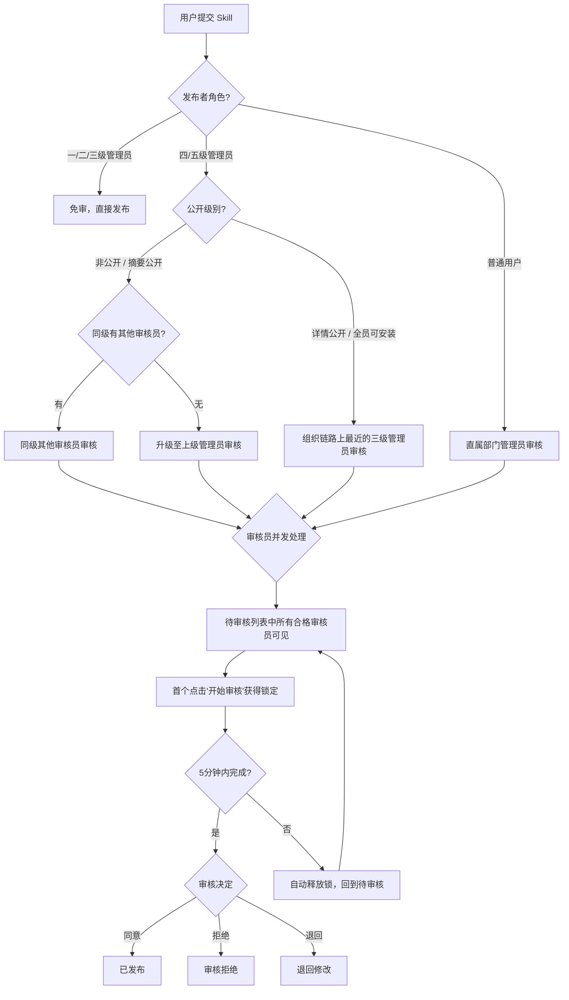
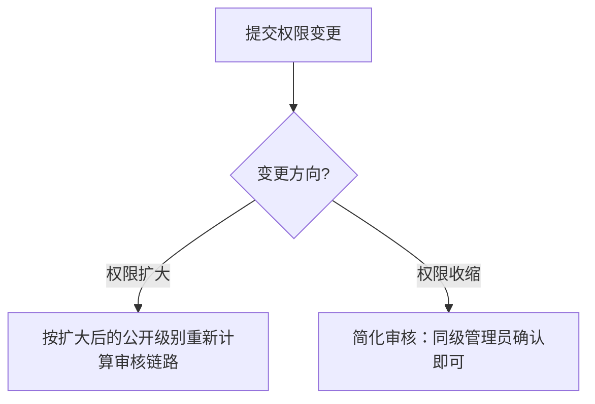

# 4. 用户角色与权限模型

> 当前说明：Desktop 已接入显式菜单权限。游客态只使用主页 / 社区 / 本地等基础能力；登录后由服务端下发 `menuPermissions`，并据此决定是否显示“管理”入口及内部模块。管理员体系当前采用 `role + adminLevel` 中间态模型：`role=admin` 且 `adminLevel` 越小权限越高。

## 4.1 角色分类
系统包含以下角色：

- **普通用户**
- **部门管理员（多级）**
  - 一级管理员（兼任**全局管理员/系统管理员**职责）
  - 二级管理员
  - 三级管理员
  - 四级及以上管理员（按实际组织层级扩展）

> **说明：**
> - 系统初始化时创建一个**一级管理员**账户
> - 用户新增和角色分配由**上一级管理员**操作
> - 一级管理员承担全局管理和跨部门治理职责
> - 当前实现使用 `users.role` + `users.admin_level` 表达管理员层级；完整可配置权限模型留待后续
> - 账号由管理员在自建账号体系中开通；手机号作为唯一登录凭证，格式为 1 开头的 11 位数字；用户名称用于社区、Skill 作者、审核提交人等外显场景且允许重名，内部账号 ID 不对外展示；企业系统或统一身份源接入进入后续版本

## 4.2 角色职责概述

### 4.2.1 普通用户
- 浏览市场
- 搜索 skill
- 查看有权限的详情
- 安装 / 启用 / 停用 / 卸载 skill
- 发布 skill
- 查看自己发布的 skill
- 撤回自己待审核中的 skill
- 删除自己已发布的 skill（归档）

### 4.2.2 管理员
- 审核本部门及下级部门提交的 skill
- 管理本部门用户
- 管理本部门所有后代部门（不限层级）
- 查看本部门及可管理范围内的 skill
- 下架 / 上架 / 删除本管辖范围内的 skill
- 新增用户、分配角色（仅可设置低于自身级别的角色）
- 修改本管辖范围内用户密码，且修改后立即使该用户现有会话失效；管理端改密作为最终密码生效，不触发下次登录强制改密

### 4.2.3 一级管理员（全局管理员）
在管理员职责基础上，额外拥有：
- 跨部门紧急下架任何 skill（含全员可安装 skill 的安全处置）
- 系统初始配置
- 全局用户和部门管理

---

## 4.3 功能权限矩阵

### 市场与使用

| 功能 | 普通用户 | 四/五级管理员 | 三级管理员 | 二级管理员 | 一级管理员 |
|------|:--------:|:------------:|:----------:|:----------:|:----------:|
| 市场浏览 | ✅ | ✅ | ✅ | ✅ | ✅ |
| 搜索 skill | ✅ | ✅ | ✅ | ✅ | ✅ |
| 查看授权范围内详情 | ✅ | ✅ | ✅ | ✅ | ✅ |
| 查看摘要/详情公开 skill | ✅ | ✅ | ✅ | ✅ | ✅ |
| 安装/启用/卸载/停用 skill | ✅ | ✅ | ✅ | ✅ | ✅ |
| Star/取消 Star | ✅ | ✅ | ✅ | ✅ | ✅ |
| 发布 skill | ✅ | ✅ | ✅ | ✅ | ✅ |
| 撤回/删除自己的 skill | ✅ | ✅ | ✅ | ✅ | ✅ |

### 审核与管理

| 功能 | 普通用户 | 四/五级管理员 | 三级管理员 | 二级管理员 | 一级管理员 |
|------|:--------:|:------------:|:----------:|:----------:|:----------:|
| 审核本部门/下级 skill | ❌ | ✅ | ✅ | ✅ | ✅ |
| 下架/上架本管辖范围 skill | ❌ | ✅ | ✅ | ✅ | ✅ |
| 管理本部门用户 | ❌ | ✅ | ✅ | ✅ | ✅ |
| 管理所有后代部门 | ❌ | ✅ | ✅ | ✅ | ✅ |
| 新增/删除/冻结用户 | ❌ | ✅ | ✅ | ✅ | ✅ |
| 修改用户密码 | ❌ | ✅ | ✅ | ✅ | ✅ |
| 跨部门紧急下架 | ❌ | ❌ | ❌ | ❌ | ✅ |
| 系统初始配置 | ❌ | ❌ | ❌ | ❌ | ✅ |

### 当前菜单权限下发口径

| 菜单 / 入口 | 游客 | 普通用户 | 管理员 |
|-------------|:----:|:--------:|:------:|
| 主页 / 社区 / 本地 / 设置 | ✅ | ✅ | ✅ |
| 通知 | 入口可见，触发远端跳转时需登录 | ✅ | ✅ |
| 管理 | ❌ | ❌ | 登录态中最近一次后端 `menuPermissions` 包含管理菜单时显示；短暂离线或本地命令失败不得移除入口，401/403 权限失效时才收缩 |

### 管理范围

| 管理维度 | 范围说明 |
|---------|---------|
| 部门查询 | 本部门及所有后代部门 |
| 部门新增 | 本部门或后代部门下新增下级部门 |
| 部门修改/删除 | 仅后代部门 |
| 不可操作 | 本部门自身及上级部门 |
| 用户管理 | 本部门及所有后代部门的用户 |
| Skill 下架 | 本管辖范围内的 skill（跨部门仅一级管理员） |

---

## 4.4 审核规则

### 审核链路矩阵

| 发布者角色 | 发布类型 | 审核方式 |
|-----------|---------|---------|
| 普通用户 | 任何类型 | **直属部门管理员**审核 |
| 四/五级管理员 | 非公开 / 摘要公开 | 同级其他审核员 → 无则升级上级 |
| 四/五级管理员 | 详情公开 / 全员可安装 | 组织链路上最近的**三级管理员**审核 |
| 三级管理员 | 任何类型 | **免审** |
| 二级管理员 | 任何类型 | **免审** |
| 一级管理员 | 任何类型 | **免审** |

### 关键定义

**"直属部门管理员"**：用户当前所属部门的管理员。

**"同级审核员"**：同一父部门下的、与发布者同级别的其他管理员。

```
举例：
集团（一级 M1）
├── 技术部（二级 M2）
│   ├── 前端组（三级 M3a）
│   └── 后端组（三级 M3b）
│       ├── Java 小组（四级 M4a）
│       └── Go 小组（四级 M4b）

M4a 发布非公开 skill → 同级审核员 = M4b（后端组下所有四级，排除自己）
M4a 发布全员可安装 skill → 组织链路上最近三级 = M3b
```

审核任务通知只发送给上述规则计算出的最近一级可审核人，不向所有上级广播。最终可见性与操作权限仍以打开审核工作台时的实时组织链路计算为准。

**三级管理员审核查找规则**：沿发布者所属组织链路向上查找最近的三级管理员。如果链路上无三级，继续找二级；无二级则找一级。

**审核链路绑定**：始终按用户**当前所属部门**实时计算，用户调部门后按新链路审核。

---

## 4.5 审核链路决策树



---

## 4.6 权限变更审核链路

权限变更单的审核链路依据变更方向差异化处理：



- **权限扩大**（如部门内 → 全员可安装）：按扩大后的公开级别重新计算审核链路
- **权限收缩**（如全员 → 部门内）：简化审核，仅需同级管理员确认
- 权限变更审核期间，**原权限配置继续生效**

---

## 4.7 审核员并发规则
- 同级多个审核员时，待审单据默认都可见
- 首个点击"开始审核"的审核员获得锁定
- 其他审核员看到状态为"审核中 / 已被某某锁定"
- 锁单超时为 **5 分钟**
- 超时后自动释放，单据恢复到领取前状态，其他审核员可重新领取
- 不提供强制解锁机制
- 无需转交流程
