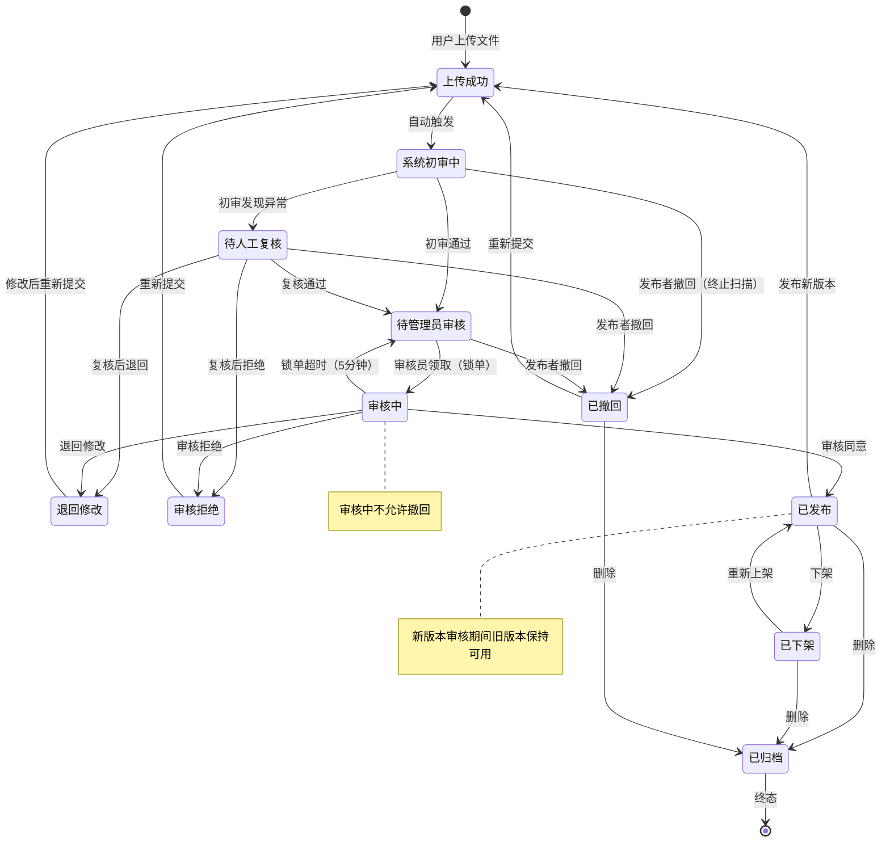
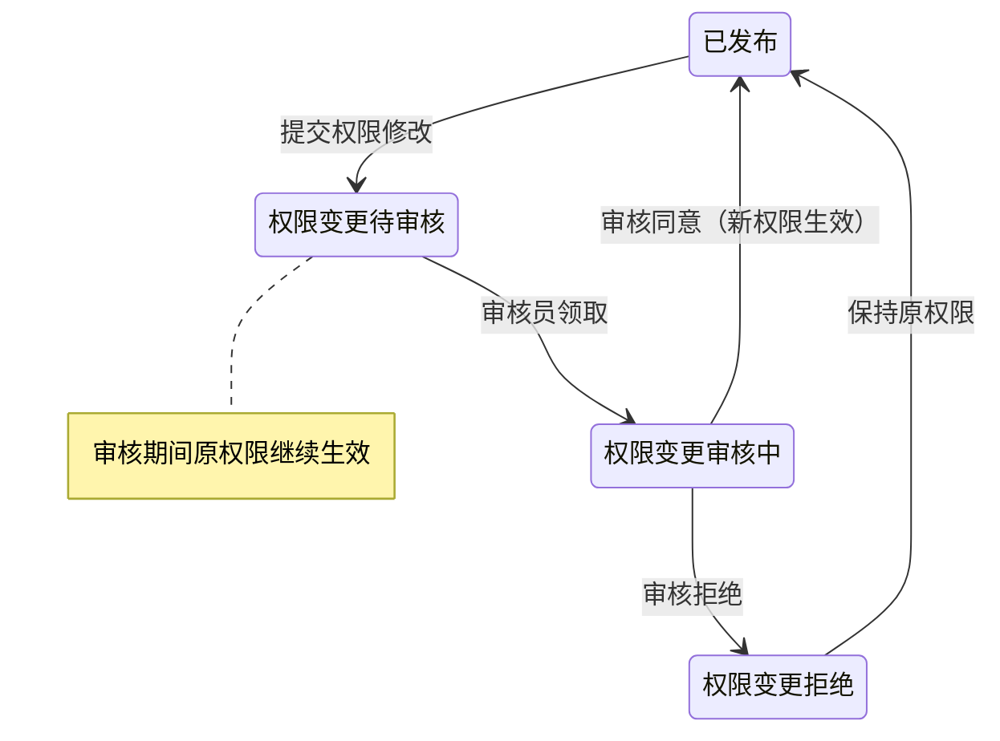

# 6. Skill 生命周期状态定义

> 阶段说明：生命周期状态机服务完整发布审核闭环。P1 Desktop 只展示服务端返回的已发布、已下架、已归档、权限收缩、有更新等消费侧状态；上传、初审、人工复核、审核中、退回修改等流程状态进入 P2。P1 不执行风险脚本扫描。

Skill 生命周期统一为以下状态（已移除"草稿"和"更新待审核"状态）：

- 上传成功
- 系统初审中
- 待人工复核
- 待管理员审核
- 审核中
- 审核拒绝
- 退回修改
- 已发布
- 已下架
- 已撤回
- 已归档

> **V1.2 变更：**
> - 移除"草稿"状态：用户上传文件后直接进入"上传成功"，审核拒绝后可直接"重新提交"
> - 移除"更新待审核"状态：首次发布和版本更新使用同一套状态流转，通过字段 `publish_type` 区分（`first_publish` / `update`）

---

## 6.1 状态流转图

---

## 6.2 状态说明

| 状态 | 说明 | 可执行操作 |
|------|------|-----------|
| 上传成功 | 文件已上传，等待进入系统初审 | 撤回 |
| 系统初审中 | 系统执行结构、元信息、安全扫描 | 撤回（终止扫描） |
| 待人工复核 | 系统初审发现问题，转人工复核 | 撤回 |
| 待管理员审核 | 进入人工审核队列，未被锁单 | 撤回 |
| 审核中 | 已有审核员领取并处理 | **不可撤回** |
| 审核拒绝 | 审核不通过 | 重新提交 |
| 退回修改 | 允许发布者修改后重新提交 | 重新提交 |
| 已发布 | 当前版本已正式进入市场 | 下架、删除、发布新版本、修改权限 |
| 已下架 | 市场不再展示/安装，已安装不受影响 | 重新上架、删除 |
| 已撤回 | 发布者在审核完成前撤回 | 重新提交、删除 |
| 已归档 | 逻辑删除终态 | 无 |

---

## 6.3 撤回规则
- **系统初审中**：可撤回，系统需终止正在进行的扫描任务
- **待人工复核**：可撤回
- **待管理员审核**：可撤回
- **审核中**（已被审核员锁单）：**不可撤回**，需等待审核员完成

---

## 6.4 权限变更状态流
权限变更单（修改授权范围/公开级别）走独立的权限变更审核流，不混入版本发布状态。权限变更审核期间，**原权限配置继续生效**。

---

## 6.5 状态与用户可见性要求

### 普通用户 / 发布者
在"我的 Skill"中可看到：
- 当前状态
- 当前审核阶段
- 当前版本
- 最近更新时间
- 审核结果 / 拒绝原因 / 退回原因

### 审核员
在审核工作台中可看到：
- 当前状态
- 风险等级
- 锁定状态
- 提交人
- 提交部门
- 版本信息
- 发布时间 / 更新时间
- 是否为权限变更单
- 发布类型（首次发布 / 更新发布）
