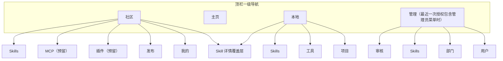
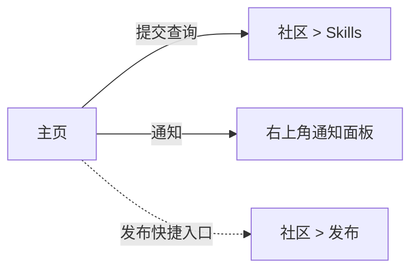
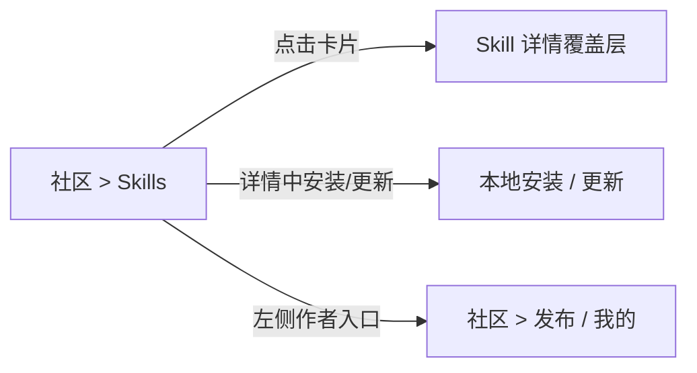
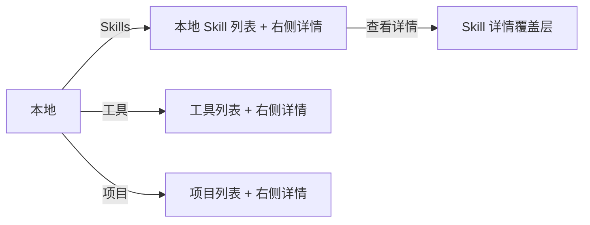

# 7. 页面架构与导航

## 7.1 一级入口

当前正式桌面端已经不再使用“左侧主导航 + 多个一级页面”的旧结构，而统一收敛为**顶栏分段导航**。

产品采用游客优先模式：
- `社区 / 主页 / 本地` 默认可见
- `管理` 在登录态中最近一次后端 `menuPermissions` 包含任一管理员菜单权限时显示；短暂离线或本地命令失败不得移除入口，401/403 权限失效后才收缩

| # | 一级入口 | 角色可见性 | 说明 |
|---|----------|-----------|------|
| 1 | 社区 | 全部 | Skill 发现、搜索、筛选、排序、安装与详情；MCP/插件仅占位 |
| 2 | 主页 | 全部 | 中心探索入口，只承载 Agent 探索主舞台 |
| 3 | 本地 | 全部 | 统一收口已安装 Skill、工具与项目能力 |
| 4 | 管理 | 具备缓存或在线管理员权限的登录用户 | 审核、Skills、部门、用户统一工作台 |

补充说明：
- 通知固定为顶栏右上角铃铛，不作为一级页面
- 发布中心不再占据一级导航，当前实现收口为社区内的作者工作区：左侧作者分区提供 `发布 / 我的`
- 目标管理不再占据一级导航，相关能力迁入“本地”页内部的 `工具 / 项目`
- 设置、登录、Skill 详情优先使用模态 / 抽屉 / 覆盖层；作者治理入口固定留在社区工作区内

---

## 7.2 全局布局

```text
┌─────────────────────────────────────────────────────────────┐
│ 品牌区      社区 / 主页 / 本地 / 管理      通知 / 头像入口 │
└─────────────────────────────────────────────────────────────┘

┌─────────────────────────────────────────────────────────────┐
│                    当前一级入口舞台区                       │
│  - 主页：单舞台 Agent 探索                                  │
│  - 社区：左侧入口 + 顶部功能栏 + 搜索/卡片/热榜             │
│  - 本地：左侧入口 + 顶部功能栏 + 中间列表 + 右侧详情         │
│  - 管理：左侧入口 + 顶部功能栏 + 列表/详情联动              │
└─────────────────────────────────────────────────────────────┘
```

### 顶栏

| 元素 | 说明 |
|------|------|
| Logo / 应用名称 | 点击回主页 |
| 顶栏分段导航 | 一级切换：社区、主页、本地、管理 |
| 通知铃铛 | 显示未读数量角标；点击打开通知面板 |
| 账号入口 | 游客态显示本地模式 / 登录；登录后显示身份、角色、服务状态，并支持在“我的信息”中修改本人密码 |

### 页面内部结构

- **主页**：纯 Agent 探索舞台，标题 + 提问编辑框 + 上下文 pills
- **社区**：左侧保留发现分区 `Skills / MCP / 插件`，并在作者分区提供 `发布 / 我的`
- **本地**：左侧 `Skills / 工具 / 项目` 入口；Skills 保留主列表 + 右侧详情，工具和项目改为单列表
- **管理**：左侧 `审核 / Skills / 部门 / 用户` 入口，主区为统一列表与详情联动；一级管理员额外显示 `客户端更新`

### 覆盖层规则

- 登录、设置、Skill 详情、启用范围都位于顶栏之上
- Skill 详情当前正式交付为覆盖层，而非独立页面

---

## 7.3 角色菜单差异

| 入口 / 能力 | 游客 / 普通用户 | 在线管理员 |
|-------------|:---------------:|:----------:|
| 主页 | ✅ | ✅ |
| 社区 | ✅ | ✅ |
| 本地 | ✅ | ✅ |
| 管理 | ❌ | 最近一次后端授权包含管理员菜单时显示；权限失效后收缩 |
| 通知铃铛 | ✅ | ✅ |
| 设置 | ✅ | ✅ |
| 社区作者工作区（发布 / 我的） | ✅（触发时先登录） | ✅ |
| Skill 详情覆盖层 | ✅ | ✅ |

管理员权限仍以后端 `menuPermissions` 为准，前端只负责将：
- `review` -> `管理 / 审核`
- `admin_skills` -> `管理 / Skills`
- `admin_departments` -> `管理 / 部门`
- `admin_users` -> `管理 / 用户`

`管理 / 客户端更新` 是一级管理员专用入口，用于上传开发环境构建好的 Windows `exe` 并推送给客户端；后端仍必须校验一级管理员身份。

离线保留规则：
- 已登录管理员短暂离线时，客户端可继续显示上次成功验权得到的管理入口和本地可读缓存。
- 离线期间不得执行发布、审核、管理写操作；恢复联网并验权成功后再允许写入。
- 后端返回 401/403、退出登录或会话失效时，立即清理远端身份并收缩管理入口。

---

## 7.4 信息架构



---

## 7.5 页面跳转关系

### 从主页出发



### 从社区出发



### 从本地出发


